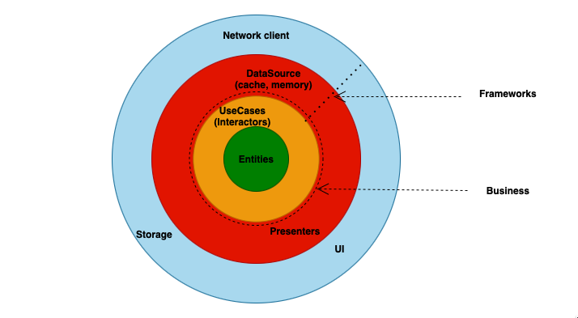
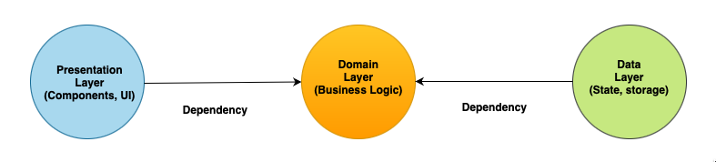
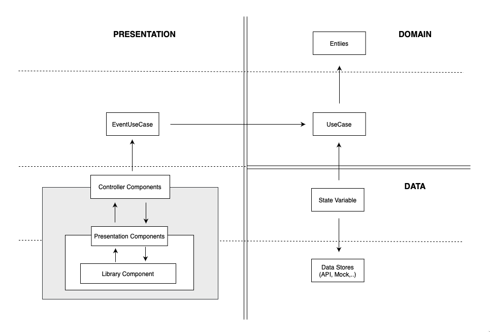

# React Clean Architecture

# 1. Overview



- **Presentation Layer**: UI + Handler + Library Components
- **Domain Layer**: UseCase + Entities
- **Data Layer**: Storage + Redux + State

# 2. Dependency Direction

- There is no dependency from the inner layer to the outer layer. There is only a dependency from the outer layer on the inner layer.



# 3. Details



## Data layer

The data layer is the layer that stores the application's data such as redux storage, state, and local variables when the application launches or takes data from outside the application, it will be retained by the data layer and allocated for events that require access.

Initialize redux store to store global state

```tsx
import { createSlice } from "@reduxjs/toolkit";
import { RootState } from "../../../../Redux/Store";
import { UserSliceType } from "../Type/Type";

const initialState: UserSliceType = {
    loading: false,
};

export const userSlice = createSlice({
    name: "user",
    initialState,
    reducers: {
        setLoading: (state, action) => {
            state.loading = action.payload;
        },
    },
});

// export state

export const loading = (state: RootState) => state.user.loading;

export const { setLoading } = userSlice.actions;

export default userSlice.reducer;
```

  Khởi tạo hooks để lưu trữ local state

```tsx
const [user, setUser] = useState<any>();
```

## Domain layer

As the layer that implements the system's business logic, here will be implemented to initialize the services that execute the emitted tasks. Make HTTP requests, handle computational logic, etc.

Initiate service call HTTP request

```tsx
import { UserApi } from "./ServiceImpl";

const UserService = (api: UserApi) => {
    const getUserRandom = async (params?: any): Promise<any> => {
        try {
            const response = await api.getUserRandom(params);
            return response.data;
        } catch (error) {
            console.log(error); // Handler error is here
        }
    };

    return {
        getUserRandom,
    };
};

export default UserService;
```

**Api Request**

```tsx
import axiosConfig from "../../../../Configs/Config";

const UserApi = () => {
    const getUserRandom = async (params?: any): Promise<any> => {
        const url = "";
        return await axiosConfig.get(url, { params });
    };

    return {
        getUserRandom,
    };
};

export default UserApi;
```

## Presentation layer

As the layer responsible for viewing information to users with UI and library components, this layer is divided into logic processing and presentation.

**Controller**

Initialize to call events, variables from the Domain layer, Data layer. To perform UI logic processing before presenting to the user.

```tsx
import { useState } from "react";
import { UserApi } from "../../Usecase/ServiceImpl";

const UserHandler = (api: UserApi) => {
    const [user, setUser] = useState<any>();

    const getDataUserRandom = async () => {
        const response = await api.getUserRandom();
        setUser(response?.results ?? {});
    };

    return {
        getDataUserRandom,
    };
};

export default UserHandler;
```

```tsx
import React from "react";
import { UserProps } from "../../Entity/Entity";

const MainUI = ({ handler }: UserProps) => {
    React.useEffect(() => {
        handler.getDataUserRandom();
    }, []);

    return <></>;
};

export default MainUI;
```

**Presenter**

It is the task layer that receives the passed props and then views the information to the user. In this section, there will be a few rules to ensure the performance of the application.

**Rule**

- This layer is communicated by props through the interface
- Props must be explicitly typed
- Component must be wrapped in Memo in case it is not necessary to render multiple times when the passed props do not change in value.

```tsx
import { Card } from "antd";
import { UserPresenterProps } from "../../Entity/Entity";

const { Meta } = Card;

const UserPresenterComponent = ({ name, image }: UserPresenterProps) => {
    return (
        <>
            <Card
                hoverable
                style={{ width: 240 }}
                cover={
                    
                }
            >
                <Meta
                    title="Europe Street beat"
                    description="www.instagram.com"
                />
            </Card>
        </>
    );
};

export default UserPresenterComponent;
```
